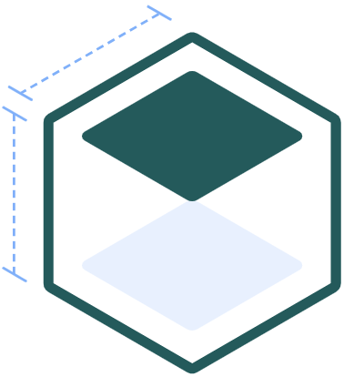

<p align="center">
  
</p>

<h1 align="center">React ResizeObserver Hook</h1>

<p align="center">
  
  
  
  <a href="CODE-OF-CONDUCT.md"></a>
</p>

---

> Observe multiple DOM elements with a single ResizeObserver.

This package provides you with:

- a context `<Provider>` with a `ResizeObserver` instance;
- a `useResizeObserver()` hook to observe any element's size changes.

This allows you to know the size of each observed element.

# 📚 Docs

This package was developed **and documented** as part of the [`@envato/react-breakpoints`](https://github.com/envato/react-breakpoints) package. It's separated into its own package because I believe it can be used separately if you don't need all the abstractions that React Breakpoints gives you. Please refer to the [React Breakpoints API Docs](https://github.com/envato/react-breakpoints/blob/main/docs/api.md) for more details about `<Provider>` and `useResizeObserver()`.

# ⚡️ Quick start

```shell
npm install @envato/react-resize-observer-hook
```

## Set up the provider

```jsx
import { Provider as ResizeObserverProvider } from '@envato/react-resize-observer-hook';

const App = () => <ResizeObserverProvider>...</ResizeObserverProvider>;
```

⚠️ **Caution** — You may need to pass some props to `<Provider>` to increase **browser support**. Please refer to the [React Breakpoints API Docs](https://github.com/envato/react-breakpoints/blob/main/docs/api.md#provider).

## Observe an element

```jsx
import { useResizeObserver } from '@envato/react-resize-observer-hook';

const ObservedDiv = () => {
  const [ref, observedEntry] = useResizeObserver();
  const { width, height } = observedEntry.contentRect;

  return (
    <div ref={ref}>
      This element is {width}px wide and {height}px high.
    </div>
  );
};
```

Depending on your implementation of `ResizeObserver`, the internal `ResizeObserverEntry` can contain size information about multiple "boxes" of the observed element. Observing these boxes instead of `contentRect` (default) can be done by passing an options object to the hook:

```javascript
const options = {
  box: 'border-box'
};

const [ref, observedEntry] = useResizeObserver(options);

const width = observedEntry.borderBox[0].inlineSize;
const height = observedEntry.borderBox[0].blockSize;
```

See [MDN reference guide](https://developer.mozilla.org/en-US/docs/Web/API/ResizeObserver) for further information.

# Maintainers

- [Marc Dingena](https://github.com/mdingena) (owner)

# Contributing

For bug fixes, documentation changes, and small features:

1. Fork this repository.
1. Create your feature branch (git checkout -b my-new-feature).
1. Commit your changes (git commit -am 'Add some feature').
1. Push to the branch (git push origin my-new-feature).
1. Create a new Pull Request.

**For larger new features**: Do everything as above, but first also make contact with the project maintainers to be sure your change fits with the project direction and you won't be wasting effort going in the wrong direction.
